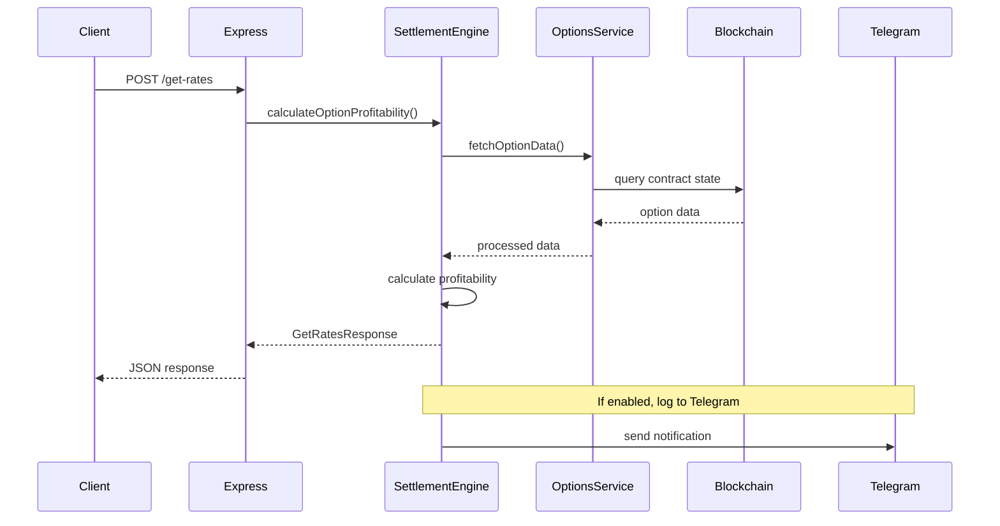
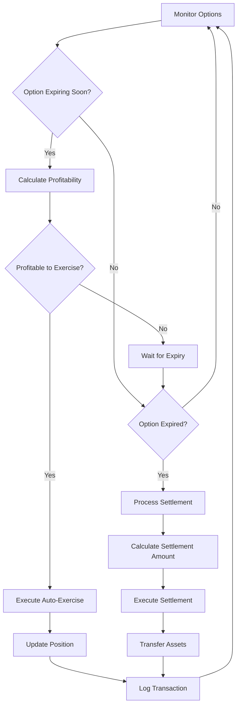

# Exercise Settlement Engine

[](https://github.com/your-org/exercise_settlement_engine)
[](https://github.com/your-org/exercise_settlement_engine)
[](https://github.com/your-org/exercise_settlement_engine)
[](https://github.com/your-org/exercise_settlement_engine)

## Overview

The Exercise Settlement Engine is a sophisticated Node.js application that monitors and manages options across DopexV2 Option Markets, automatically exercising profitable options near expiry and settling expired options. It integrates with AutoExerciseTimeBased, OpenSettlement, and Swapper Contracts to provide a comprehensive solution for DeFi options management. The engine solves the critical problem of manual options management by automating the exercise and settlement processes, ensuring optimal profitability and timely execution.

## Core Features

- **Automated Option Exercise**: Monitors options within configurable time windows (default: 5 minutes) of expiry and automatically exercises profitable positions
- **Intelligent Settlement Engine**: Processes expired options and handles settlement through integrated swapper contracts
- **Multi-Chain Support**: Built-in support for Base, Optimism, and Arbitrum networks with extensible chain configuration
- **Real-time Profitability Calculation**: Advanced algorithms to determine optimal exercise timing and profitability
- **Telegram Integration**: Configurable notifications for critical events, errors, and system status updates
- **REST API**: HTTP endpoints for option profitability calculations and system monitoring

## Architecture Overview & Flowcharts

This is a monolithic Node.js application built with TypeScript, featuring a modular service-oriented architecture. The system consists of a core SettlementEngine that orchestrates various services including OptionsService, ChainConfigService, and TelegramService. It uses Viem for blockchain interactions and Winston for comprehensive logging.

### Request/Response Lifecycle



### Core Data Flow - Option Exercise & Settlement



## Tech Stack

### Backend
- **Runtime**: Node.js 18+
- **Language**: TypeScript 5.7+
- **Framework**: Express.js 4.18+
- **Package Manager**: pnpm

### Blockchain & DeFi
- **Ethereum Client**: Viem 2.23+
- **Uniswap Integration**: @uniswap/v3-sdk, @uniswap/sdk-core
- **Supported Chains**: Base, Optimism, Arbitrum

### Infrastructure & Monitoring
- **Logging**: Winston 3.17+
- **HTTP Client**: Axios 1.7+
- **Notifications**: Telegram Bot API
- **Process Management**: Nodemon 3.1+

### Development & Testing
- **Testing Framework**: Jest 29.7+
- **Type Checking**: TypeScript Compiler
- **Code Quality**: ESLint (recommended)

## Getting Started - Developer Onboarding

### Prerequisites

- **Node.js**: `v18.x` or higher
- **pnpm**: `8.x` or higher (recommended) or npm `9.x`+
- **Git**: Latest stable version
- **Access to**: Ethereum RPC endpoints for Base, Optimism, and Arbitrum

### Installation

```bash
# Clone the repository
git clone https://github.com/your-org/exercise_settlement_engine.git
cd exercise_settlement_engine

# Install dependencies
pnpm install

# Build the project
pnpm run build
```

### Configuration

Create a `.env` file in the root directory with the following variables:

```env
# Required: Private key for transaction signing
PRIVATE_KEY=0x...

# Required: Base URL for options data API
API_BASE_URL=https://api.example.com

# Optional: Telegram bot configuration
TELEGRAM_BOT_TOKEN=your_bot_token_here
TELEGRAM_CHAT_ID=your_chat_id_here
TELEGRAM_ENABLED=false

# Optional: Logging configuration
LOG_LEVEL_ERROR=true
LOG_LEVEL_WARN=false
LOG_LEVEL_INFO=false

# Optional: Server configuration
SERVER_PORT=3000
PORT=3000  # Railway deployment
```

**Environment Variables Explained:**
- `PRIVATE_KEY`: Ethereum private key for signing transactions (required)
- `API_BASE_URL`: Base URL for the options data service (required)
- `TELEGRAM_BOT_TOKEN`: Telegram bot token for notifications (optional)
- `TELEGRAM_CHAT_ID`: Telegram chat ID for notifications (optional)
- `TELEGRAM_ENABLED`: Enable/disable Telegram notifications (default: false)
- `LOG_LEVEL_*`: Control which log levels are sent to Telegram
- `SERVER_PORT`: Local development server port (default: 3000)
- `PORT`: Production server port (used by Railway)

### Running the Application

```bash
# Development mode with hot reload
pnpm run dev:watch

# Development mode (single run)
pnpm run dev

# Production build and start
pnpm run build
pnpm start

# Local development (build + run)
pnpm run local
```

### Running Tests

```bash
# Run all tests
pnpm test

# Run tests in watch mode
pnpm test --watch

# Run tests with coverage
pnpm test --coverage
```

## Project Structure

```
exercise_settlement_engine/
├── src/                    # Source code
│   ├── abis/             # Ethereum contract ABIs
│   ├── services/         # Business logic services
│   ├── types/            # TypeScript type definitions
│   ├── index.ts          # Application entry point
│   └── SettlementEngine.ts # Core engine implementation
├── tests/                 # Test files
├── scripts/               # Build and deployment scripts
├── dist/                  # Compiled JavaScript output
├── package.json           # Dependencies and scripts
├── tsconfig.json          # TypeScript configuration
└── nodemon.json           # Development server configuration
```

## Contribution Guidelines

### Workflow

1. **Fork** the repository
2. **Create** a feature branch (`git checkout -b feature/amazing-feature`)
3. **Make** your changes following the coding standards
4. **Test** your changes thoroughly
5. **Commit** using conventional commit format
6. **Push** to your branch (`git push origin feature/amazing-feature`)
7. **Submit** a Pull Request

### Coding Standards

- Follow TypeScript best practices and strict mode
- Use meaningful variable and function names
- Add JSDoc comments for public methods
- Ensure all tests pass before submitting PR
- Follow the existing code style and formatting

### Commit Message Format

This project follows [Conventional Commits](https://www.conventionalcommits.org/):

```
<type>[optional scope]: <description>

[optional body]

[optional footer(s)]
```

**Examples:**
- `feat: add profitability calculation endpoint`
- `fix(engine): resolve memory leak in cache cleanup`
- `docs: update README with new configuration options`

## License

Distributed under the ISC License. See `LICENSE` file for more information.
